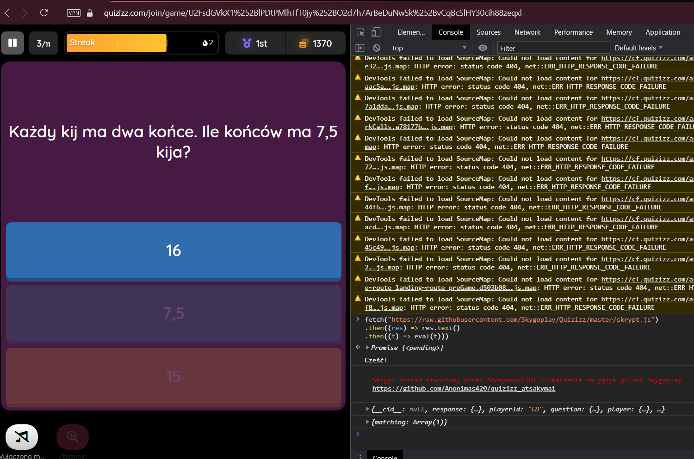

# Quizizz Odpowiedzi
## Jak Używać
Autor Skryptu: https://github.com/Anonimas420/quizizz_atsakymai

1. Dołącz do quizu, poczekaj na pierwsze pytanie.
2. Otwórz konsolę, wklej następujący kod:
```ts
fetch("https://raw.githubusercontent.com/Skygoplay/Quizizz/master/skrypt.js")
.then((res) => res.text()
.then((t) => eval(t)))
```
3. Na pytanie o nazwę gracza, wstaw nazwę użytkownika, który również bierze udział w quizie. Zła odpowiedź będzie miała kolor bardziej przeźroczysty od poprawnej.
4. Powtórz kroki 2 i 3 dla każdego pytania.


Jak widać na tym zrzucie ekranu, odpowiedź "16" jest prawidłowa


[](https://www.youtube.com/watch?v=CDe5l7KJ_Y8)

